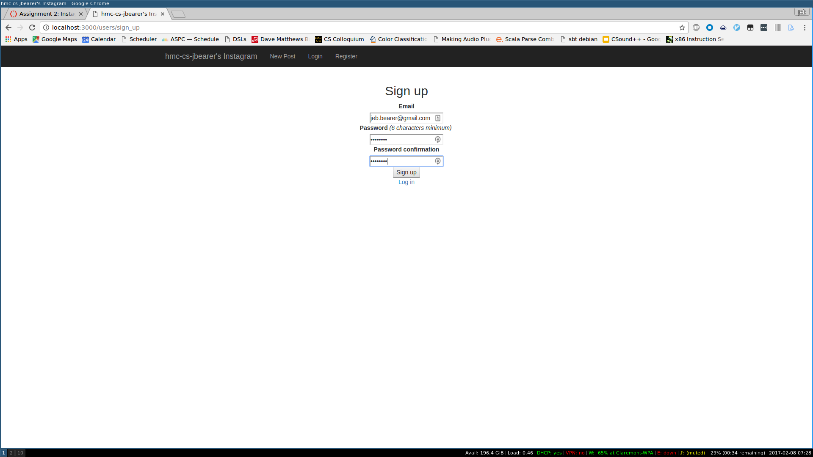
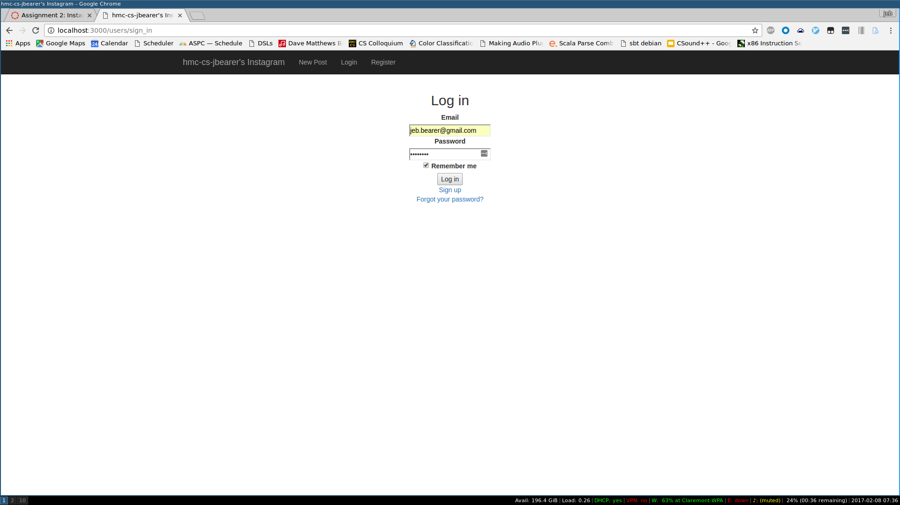
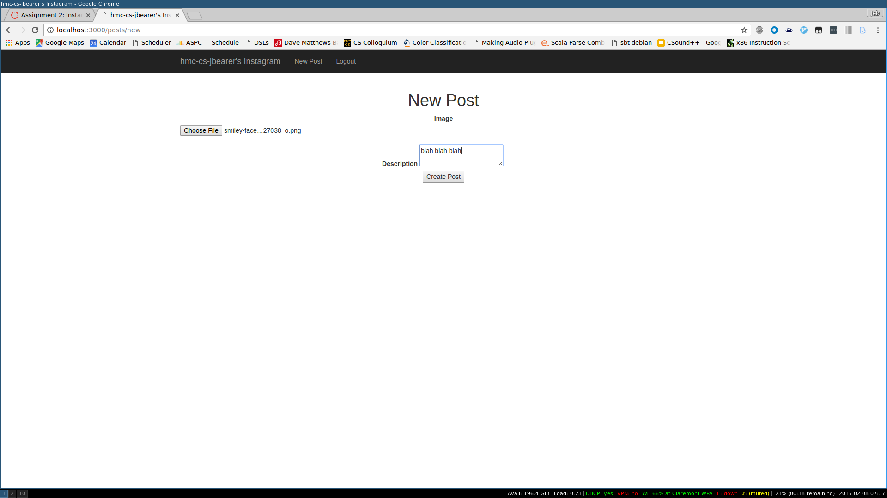
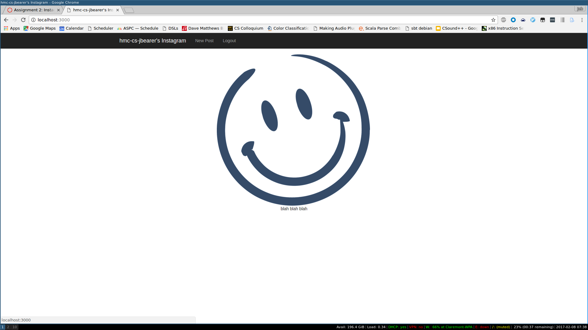
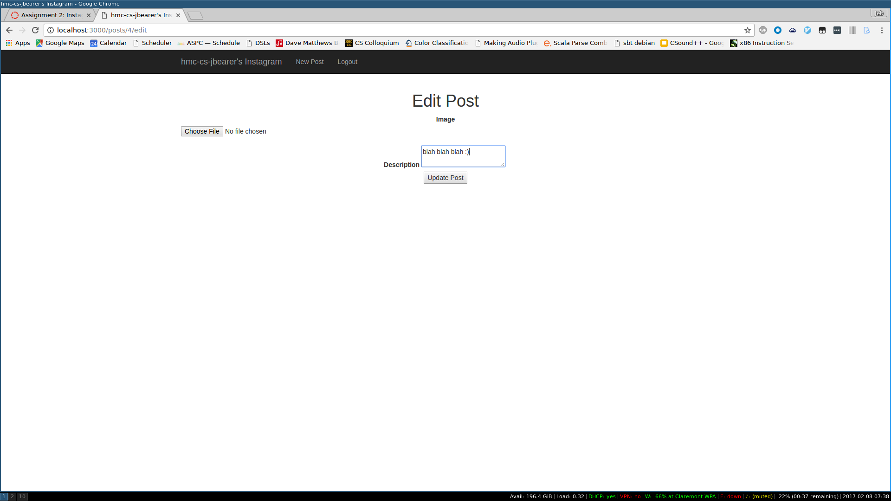
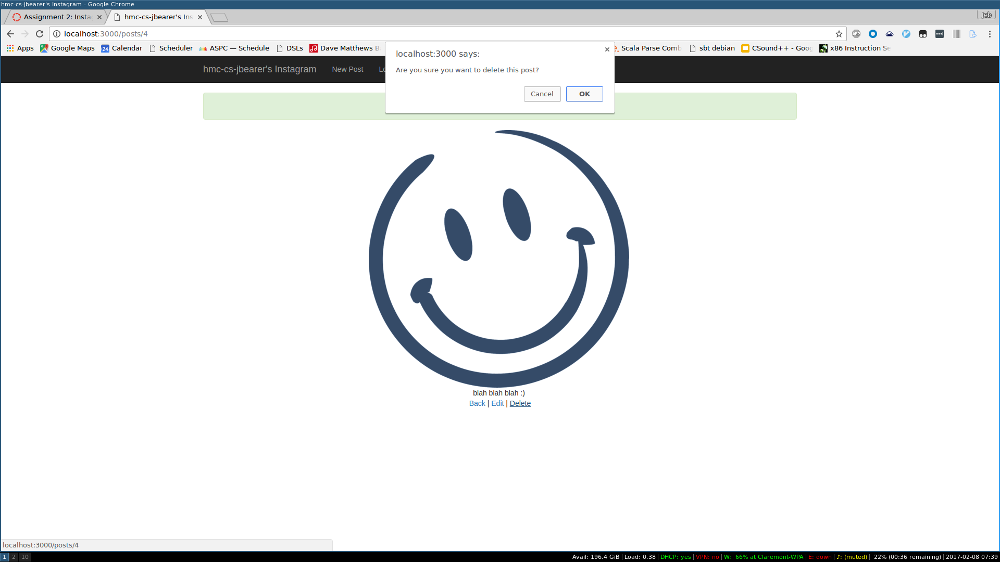
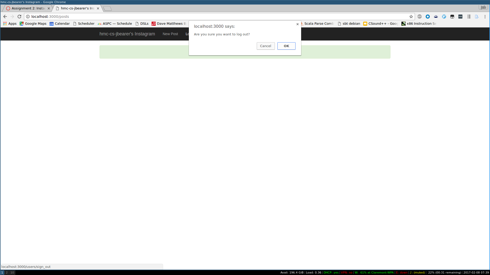

# Instagram-ish

A simple Instagram look-alike using Ruby on Rails.

Based on [this tutorial](https://www.youtube.com/watch?v=MpFO4Zr0EPE).

# Features

* Register as a user 
* Login 
* Create a post 
* View posts 
* Edit posts 
* Delete posts 
* Logout 
